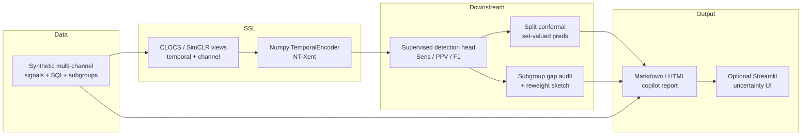

# Clinical Signal Copilot

> **NOT A MEDICAL DEVICE. NOT FOR CLINICAL USE, DIAGNOSIS, TRIAGE, OR TREATMENT.**  
> Research / education demo only. All physiological signals are **fully synthetic** (PhysioNet-*style* morphology with no real recordings and no data-licensing issues).

Staff-level research demo of a multi-stage biomedical **signal DS + AIML** stack:

**multi-channel physio signals → SSL representations → downstream detection → conformal risk sets → subgroup fairness → uncertainty-aware copilot report / UI**

## Architecture



## Package layout

| Module | Role |
|--------|------|
| `clinical_signal_copilot.signals` | Synthetic ECG-like multi-channel generator, event labels, SQI |
| `clinical_signal_copilot.ssl` | CLOCS/SimCLR-style views, NT-Xent, numpy MLP encoder |
| `clinical_signal_copilot.detection` | Supervised head + tolerance-aware Sens/PPV/F1 |
| `clinical_signal_copilot.conformal` | Split conformal sets + coverage diagnostics |
| `clinical_signal_copilot.fairness` | Synthetic protected attribute gaps + reweight mitigation |
| `clinical_signal_copilot.report` | Uncertainty / SQI / subgroup caveat report (MD + HTML) |
| `clinical_signal_copilot.ui` | Optional Streamlit uncertainty UI |
| `clinical_signal_copilot.pipeline` | End-to-end orchestration + case studies A/B/C |

## Quickstart

```bash
python -m venv .venv && source .venv/bin/activate
pip install -e ".[dev,ui]"

# Tests (must be green)
pytest

# Case studies → artifacts/report.md|html + case_studies.json
csc-case-studies --quick
# or: python scripts/run_case_studies.py --quick

# Full-ish demo
csc-case-studies --n-records 36 --epochs 5

# Optional UI
streamlit run src/clinical_signal_copilot/ui/streamlit_app.py
```

## Case studies

| ID | Question | What we measure |
|----|----------|-----------------|
| **A** | Does SSL help vs supervised-only features? | F1 / Sens delta on held-out windows |
| **B** | Do conformal risk sets hit target coverage? | Empirical coverage, avg set size, singleton rate |
| **C** | Can synthetic subgroup noise create metric gaps? | Sens/PPV/F1 gaps before/after sample reweight |

## Ethics & disclaimer

- **Not a medical device** under FDA/MDR or any jurisdiction; not SaMD; not for clinical decisions.
- **No real PHI / no PhysioNet downloads** — generator is synthetic to avoid licensing and privacy issues.
- Protected attributes are **synthetic labels (A/B)** used only to illustrate disparity *diagnostics*, not real demographics.
- Conformal guarantees require exchangeability; clinical deployment would violate this under shift, missingness, and feedback loops.
- Authors accept **no liability** for any use resembling care delivery.

## Threats to validity

1. **Synthetic → real gap:** QRS-like templates and noise models are caricatures; metrics will not transfer to ICU/ECG monitors.
2. **Small-n conformal:** Finite-sample coverage can wobble; demo uses soft diagnostics, not a regulatory validation set.
3. **Label definition:** Window-level peak presence ≠ beat-detection challenge scoring on continuous recordings.
4. **SSL compute:** Lean numpy encoder approximates SimCLR/CLOCS; not a large temporal CNN/Transformer.
5. **Fairness sketch:** Inverse-frequency reweighting is pedagogical; it is not equalized-odds post-processing or causal fairness.
6. **SQI heuristics:** Amplitude / HF / kurtosis proxies are not validated clinical SQI algorithms.
7. **Selection bias:** Train/cal/test are i.i.d. windows from the same generator — no site shift, device shift, or annotation noise.

## Design choices

- **Lean stack:** `numpy` / `scipy` / `scikit-learn` (+ optional `streamlit`). No PyTorch required.
- **MIT license**, seeded tests, public research demo.
- Banner disclaimer in package, CLI, reports, and UI.

## Citation

If you fork this for coursework or papers, cite the repository and clearly restate the non-clinical disclaimer.

## License

MIT — see [LICENSE](LICENSE).
